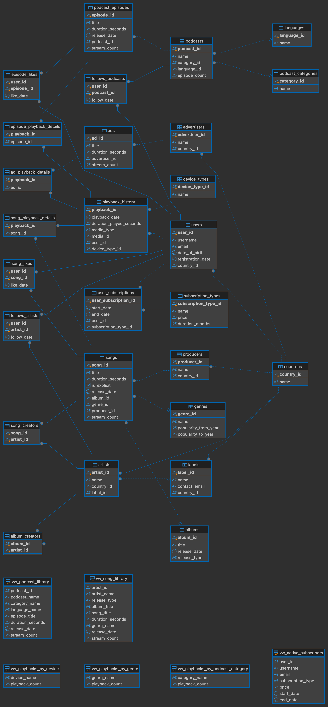

# MusicStreamingPlatform

[](https://github.com/Wuchan33/MusicStreamingPlatform/actions/workflows/ci.yml)

A PostgreSQL database for a music and podcast streaming service — catalogue,
subscriptions, listening history and the reporting on top of it. The schema,
its logic and a seed dataset come up with one command.

## Quick start

```sh
cp .env.example .env
make up
make psql
```

`make` on its own lists the other targets: `down`, `reset`, `logs`.

The scripts in `db/init` are run in name order the first time the volume is
empty. `make reset` wipes it and replays them.

## Schema

<a href="db_diagram.png">
  
</a>

Click through for full resolution. Regenerate it from DBeaver's ER Diagram
view after changing anything in `db/init`.

## Tables

| Table | Holds |
|---|---|
| `countries` | Countries, referenced by users, artists, labels, producers and advertisers |
| `languages` | Languages a podcast can be recorded in |
| `device_types` | Kinds of device a play can happen on — phone, TV, car and so on |
| `users` | Registered listeners |
| `subscription_types` | The plans on offer, each with a price and a length in months |
| `user_subscriptions` | Which plan a user held over which period; periods may not overlap |
| `labels` | Record labels |
| `genres` | Musical genres, with the years each was popular |
| `producers` | The people credited with producing songs |
| `artists` | Performers, optionally signed to a label |
| `albums` | Albums and singles |
| `songs` | Tracks, with duration, explicit flag and a running stream count |
| `song_creators` | Which artists are credited on which song |
| `album_creators` | Which artists are credited on which album |
| `podcast_categories` | Subject categories for podcasts |
| `podcasts` | Podcast series, with a running episode count |
| `podcast_episodes` | Individual episodes, with duration and a running stream count |
| `advertisers` | Companies buying advertising |
| `ads` | Individual adverts, with duration and a running stream count |
| `follows_artists` | Which users follow which artists, and when they started |
| `follows_podcasts` | Which users follow which podcasts |
| `song_likes` | Which users liked which songs |
| `episode_likes` | Which users liked which episodes |
| `playback_history` | Every play, whatever was played: who, when, how long, on what |
| `song_playback_details` | Names the song a play was, for plays of songs |
| `episode_playback_details` | Names the episode a play was, for plays of episodes |
| `ad_playback_details` | Names the advert a play was, for plays of ads |

## Triggers

Thirteen triggers run off five functions.

| Function | Does |
|---|---|
| `reject_future_date` | Rejects a date in the future. Attached nine times, once per date column, each passing its own column name |
| `set_subscription_end_date` | Fills `end_date` from the plan's length, unless one was given |
| `maintain_podcast_episode_count` | Keeps `podcasts.episode_count` correct through inserts, deletes and moves between podcasts |
| `validate_playback_history` | Checks the medium exists and the play is no longer than it — exactly as long, for ads. Rejects every update: a play is a fact, not a record to amend |
| `maintain_playback_details` | Writes the play's detail row and moves the medium's stream counter, in both directions |

## Procedures

Each raises an error if the id it is given does not exist.

| Procedure | Does |
|---|---|
| `stream_song` | Records a full play of one song, looking its length up |
| `stream_episode` | The same for a podcast episode |
| `stream_ad` | The same for an advert, which must be played in full |
| `stream_album` | Records a play of every song on an album |
| `stream_podcast` | Records a play of every episode of a podcast |
| `stream_discography` | Records a play of every song an artist is credited on |
| `like_album` | Likes every song on an album, skipping those already liked |
| `like_podcast` | Likes every episode of a podcast |
| `follow_label` | Follows every artist signed to a label |

## Functions

| Function | Returns |
|---|---|
| `get_user_most_streamed_song` | The song a user played most, ties broken by title |
| `get_user_most_streamed_album` | Their most played album, singles excluded |
| `get_user_most_streamed_artist` | Their most played artist |
| `get_user_most_streamed_genre` | Their most played genre |
| `get_user_most_streamed_episode` | Their most played podcast episode |
| `get_user_most_streamed_podcast` | Their most played podcast |
| `get_user_most_streamed_podcast_category` | Their most played podcast category |
| `get_user_listening_stats` | Minutes listened, split into songs, podcasts and ads |
| `get_artist_total_streams` | How many times an artist's songs were played |
| `get_podcast_total_streams` | How many times a podcast's episodes were played |
| `get_artist_summary` | An artist's song and album counts, total streams and followers |
| `get_podcast_summary` | A podcast's episode count, total streams and mean episode length |

## Views

| View | Shows |
|---|---|
| `vw_song_library` | The catalogue from the artist's side: one row per artist per song |
| `vw_podcast_library` | Every episode with its podcast, category and language |
| `vw_active_subscribers` | Users whose subscription covers today |
| `vw_playbacks_by_device` | Plays counted by device type |
| `vw_playbacks_by_genre` | Plays of songs counted by genre |
| `vw_playbacks_by_podcast_category` | Plays of episodes counted by podcast category |